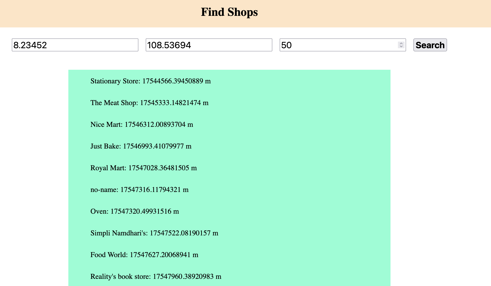

# Running the Project Locally

- Install Postgress database from here https://postgresapp.com/ for your platform. The reason is Postgis comes by default with this.
- create a virtualenvironment and install the dependencies from the requirements.txt file.

```
virtualenv venv -p python3

source venv/bin/activate

pip install -r requirements.txt

python migrate


python manage.py runserver
```

Now open `localhost:8000`

Enter all three values and you can get the nearby shops within that latitude & longitude and distance as specified.

One thing to note down here is all the shops data is for Bangalore City

## Application Preview


